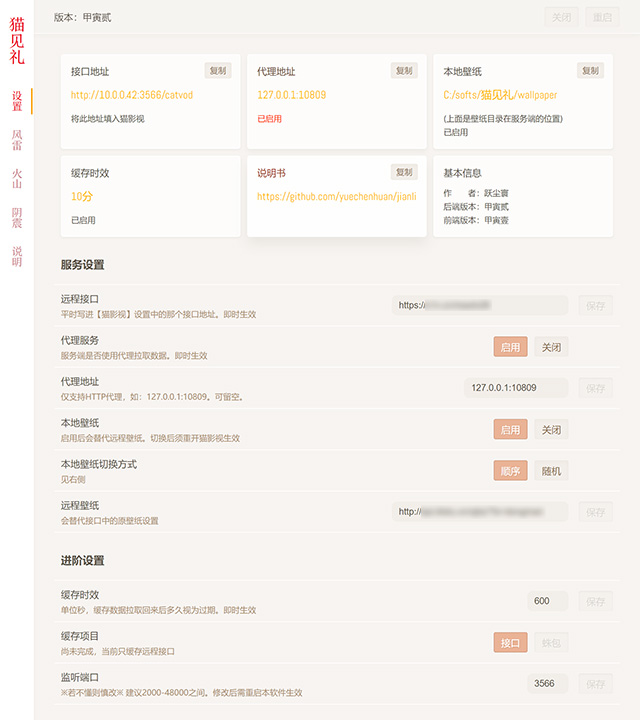
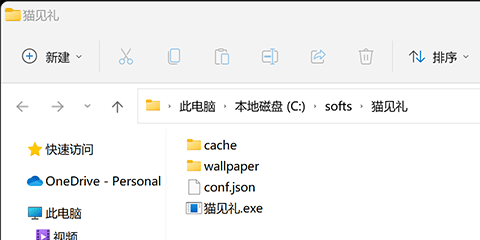
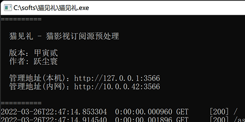
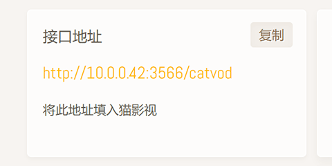
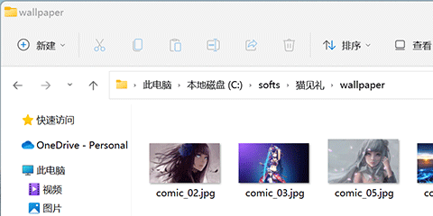

# 猫见礼 - 猫影视配置接口预处理

- 作者：跃尘寰
- 版本：甲寅贰（1.2.2）
- 日期：西元 2022/03/26

### 简介

猫影视远程接口预处理服务。
初衷为解决端口不稳定且无法自定义壁纸的问题。

- 缓存期内，接口数据秒加载。
- 远程接口不可用时使用本地缓存代替。并接口中添加标记。
- 使用 HTTP 梯子访问远程接口数据
- 使用本地壁纸。
- 在此更换接口后，内网全部猫影视接到的都是新数据，不再需要一个个重新设置。

jav 包的拉取暂时没加。

### 安装

1. 放入家中局域网内的常开机的 windows 机器，比如低功耗下载机，文件服务器等。

2. 双击打开`猫见礼.exe`，(防火墙提示需要允许)

3. 用浏览器访问上图内网地址，将其中接口地址填入猫影视。

### 自定义壁纸

将选好的图片放入 `程序文件夹\wallpaper\` 中

开启本地壁纸，如果该目录没图片，会显示一张默认的蓝色壁纸。

### 补充

- conf.json 用来保存配置，莫删。
- 缓存接口更改后，虽即时生效，但地址不变。所以要重启猫TV，或先换别的地址再换回来，让猫 TV 重新加载接口数据。
- 自定义远程壁纸，要找那种重定向的随机壁纸接口。不然猫TV不认。
